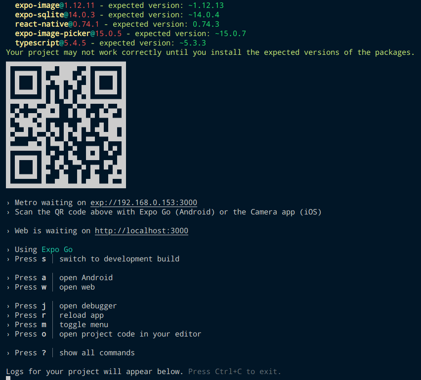
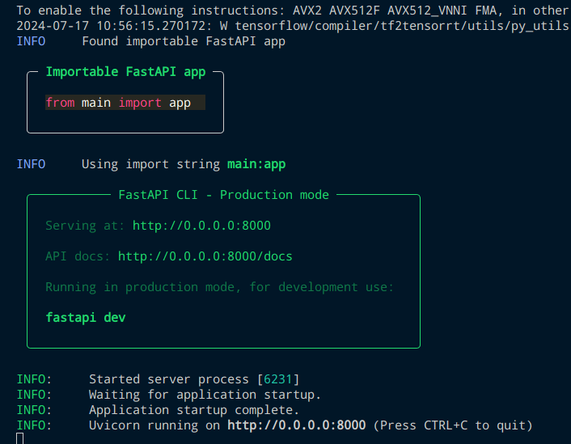

# Final-Year-Project: Image Captioning Application for the Visually Impaired

This is the Final Year Project repository for my university course. In this readme file, there will be guide on how to run the software and how to set it up in order to test it on your own device.

This is a Mobile Application made mainly for Android devices. There are 2 different folders in this repositories and you are required to set up both. One is for the frontend, which is the client-side mobile device, the other is for the backend, which is the server-side, used to generate results from the image. We will go through each folder and how to set up each of them separately.

 

## Mobile-App

### Prerequisites

This system utilises Node and Node Package Manager (NPM) and assumes that you have already installed the necessary items in your laptop or desktop devices. Furthermore, this system assumes that you have an Android emulator installed in your computer and configured properly or a physical Android device.

 

### Installation Procedure

First, navigate to the `Mobile-App` folder using the console of your choice. Then, type `npm install --force`, which will install all the necessary packages listed in the `packages.json` file. It will take some time as it installs so please wait patiently.

If you are using a physical Android device, you are also required to install an App from the Google Play Store called `Expo Go` in order to run the application on your mobile device. The version that I used was `v2.31.1` and any difference in version may cause incompatibility.

 

### Starting the Server

Finally, we have to start the server in order to run the application. If you have everything set up properly, running `npm run start` will trigger Expo and it will bundle the application and serve it. A QR code with text will be displayed once it is ready like so:

Afterwards, depending on your mobile device you will do different things. If you are running an android emulator, type `a` while in the console, which will install it into the emulator. If you have `Expo Go` installed, enter the application and click on `Scan QR Code` and scan the displayed QR Code.

That's it! That's for starting the mobile application. There are some further tweaking down the line, which we will go over once we have setup our backend server.

 

## Machine-Learning

### Prerequisites

This server utilises Python as its main module. Ensure that you have Python installed and all its configuration are properly defined.

 

### Installation Procedure

You will require to install the packages defined in the `requirements.txt` file. In order to do so, you first have to navigate to the `Machine-Learning` folder in your console. Create a virtual environment `venv` (optional) and run `pip install -r requirements.txt` which will run through the text file and install the necessary packages listed in the file.

As it contains a Machine Learning library, it will take some time to download, please wait patiently until it finishes.

 

### Starting the Server

In order to start the server, you are required to run the command `fastapi run main.py`. It will take some time to load, but eventually a box will be displayed in the console like so:

And that's it, you are done setting up this server as well.

 

## More Set Up

After setting up your environments and ensure that they can run, there are a few more checks and things that we need to do before we can use the system. First, if you are using `Expo Go`, ensure that both your mobile device and your laptop or desktop are connected to the SAME ROUTER and able to ping each other.Second, ensure that BOTH of the servers are running simultaneously. Finally, you are required to change some things in the source code.

 

### Changing IP to match Server's IP

You are required to change the IP in `/Mobile-App/screens/TakePictureScreen.tsx` and `/Mobile-App/screens/UploadFilesScreen.tsx` in the function `processData`, specifically the line `const imgCaptionUrl = 'http://192.168.16.15:8000/captions';` and modify the current IP to match the IPv4 of your laptop or desktop device. You can check for your laptop or desktop IP using `ipconfig` or similar tools that can be found online. If you are using an Android emulator, you can ping to `localhost` or `127.0.0.1` instead.

This is because your physical Android Device has a different IP address and it could not be able to ping to your laptop or desktop directly without knowing the actual IP address of the laptop.

 

### It Should Work Now. Probably.

That's it, after everything all the features should be working now.
